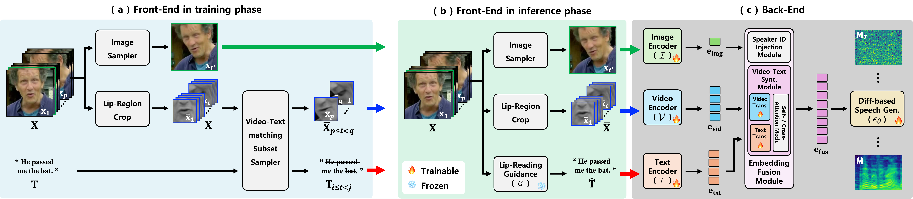

# Watch Your Speech

Official implementation of **Watch Your Speech: Text-aware Video-to-Speech
Synthesis with Lip-Reading Guidance**. WYS generates speech from a silent
talking-face video while using a lip-reading transcript to reduce the
one-to-many ambiguity of video-to-speech synthesis.



The public code supports both LRS2 and LRS3 through one Hydra dataset flag.
The default is LRS3; paths and other settings can be overridden from the
command line.

## Installation

The research environment used Python 3.9, PyTorch 1.13, and CUDA-capable
hardware. `ffmpeg` must also be available on `PATH`.

```bash
python -m venv .venv
source .venv/bin/activate
python -m pip install --upgrade pip
python -m pip install -r requirements.txt
```

PyTorch wheels are platform-specific. If the pinned wheel does not match your
CUDA runtime, install the corresponding PyTorch 1.13 build first and then
install the remaining requirements.

## Data layout

LRS2 and LRS3 are not redistributed. Obtain them under their respective
licenses and mirror each video's relative path across `videos`, `audios`, and
`mouth_rois`:

```text
datasets/
├── LRS2/
│   ├── videos/{pretrain,main,test}/<speaker>/<clip>.{mp4,txt}
│   ├── audios/{pretrain,main,test}/<speaker>/<clip>.{wav,wav.spec}
│   └── mouth_rois/{pretrain,main,test}/<speaker>/<clip>.npz
└── LRS3/
    ├── videos/{pretrain,trainval,test}/<speaker>/<clip>.{mp4,txt}
    ├── audios/{pretrain,trainval,test}/<speaker>/<clip>.{wav,wav.spec}
    └── mouth_rois/{pretrain,trainval,test}/<speaker>/<clip>.npz
```

Each mouth-ROI archive must contain a `data` array of grayscale 88×88 crops.
The transcript is the first line of the matching LRS annotation file. Override
the default root without editing a config file, for example:

```bash
python train_melgen.py dataset=lrs2 dataset.root=/data/LRS2
```

Audio extraction and mel generation helpers are included:

```bash
python dataloaders/extract_audio_from_video.py \
  --ds_dir datasets/LRS3/videos --split trainval \
  --out_dir datasets/LRS3/audios
python dataloaders/wav2mel.py dataset=lrs3
```

Mouth-ROI extraction follows the preprocessing in
[Visual Speech Recognition for Multiple Languages](https://github.com/mpc001/Visual_Speech_Recognition_for_Multiple_Languages).
The retained helper `dataloaders/extract_moutcrops.py` consumes landmark pickle
files and writes the required `.npz` files.

## Checkpoints

Model weights and generated media are intentionally excluded from this
repository. Before inference, provide:

- a WYS checkpoint containing `ema_state_dict`;
- the HiFi-GAN generator checkpoint at `hifi_gan/g_02400000`; and
- for single-video inference, the visual speech recognition model and language
  model files referenced by `mouthroi_processing/configs/LRS3_V_WER19.1.ini`.

No verified public download URL is currently provided for these files. Update
the local paths or config only after obtaining compatible checkpoints from
their respective authors.

## Training

Select the dataset with `dataset=lrs2` or `dataset=lrs3`:

```bash
python train_melgen.py dataset=lrs2
python train_melgen.py dataset=lrs3
```

Useful overrides include `dataset.root`, `train.save_dir`,
`train.batch_size_per_gpu`, and `train.ckpt_iter`. Experiment checkpoints are
written under `exp/` and are ignored by Git.

## Inference

Generate the selected dataset's full test split using predicted lip-reading
text files with matching relative clip IDs:

```bash
python inference_full_test_split.py dataset=lrs2 \
  generate.ckpt_path=/path/to/wys-lrs2.pkl \
  generate.lipread_text_dir=/path/to/predicted_text

python inference_full_test_split.py dataset=lrs3 \
  generate.ckpt_path=/path/to/wys-lrs3.pkl \
  generate.lipread_text_dir=/path/to/predicted_text
```

Run the end-to-end pipeline on one 25 fps video:

```bash
python inference_real_video.py dataset=lrs3 \
  generate.ckpt_path=/path/to/wys-lrs3.pkl \
  generate.video_path=/path/to/input.mp4
```

Outputs are written below `outputs/` by default and are ignored by Git.

## Testing

The lightweight suite validates both Hydra dataset choices, public naming,
repository contents, and Python syntax:

```bash
pytest -v
python -m compileall -q train_melgen.py inference_melgen.py \
  inference_full_test_split.py inference_real_video.py \
  dataloaders models hifi_gan mouthroi_processing
```

These checks do not replace a full GPU training or inference run.

## Citation

The paper title is **Watch Your Speech: Text-aware Video-to-Speech Synthesis
with Lip-Reading Guidance**. A BibTeX entry will be added when verified
publication metadata is available.

## Acknowledgements and license

This implementation builds on prior open-source work including LipVoicer,
DiffWave/Sashimi, Visual Speech Recognition for Multiple Languages, HiFi-GAN,
VisualVoice, and NVIDIA WaveGlow utilities. See
[THIRD_PARTY_NOTICES.md](THIRD_PARTY_NOTICES.md) for source and license links.

The repository is released under the [MIT License](LICENSE), subject to the
licenses and notices of retained third-party components.
